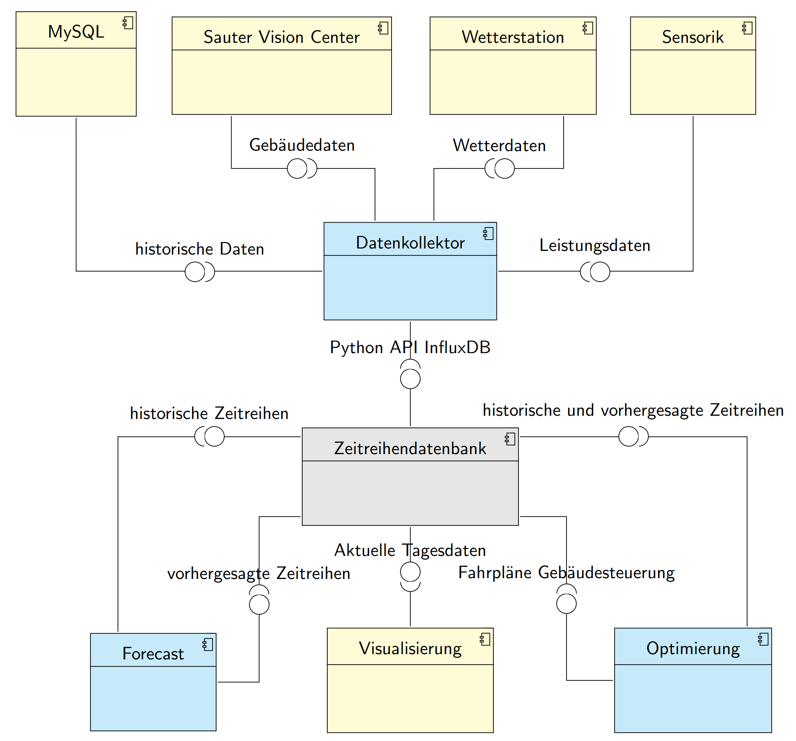
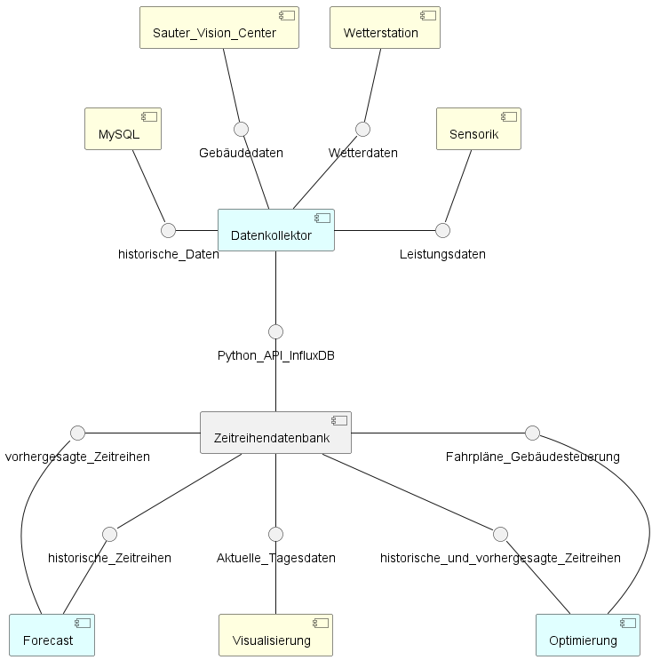
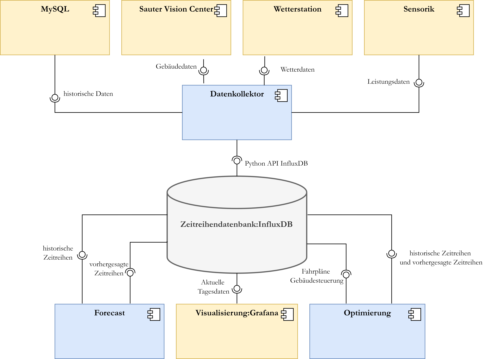

# Project description of the course *Open-Source Software for the Working Scientist*
*Author:* Marco Obermeier - Master Student of Applied Science at the [University of Applied Science Ansbach](https://www.hs-ansbach.de/en/home/) 

## Table of contents
- [Project description of the course *Open-Source Software for the Working Scientist*](#project-description-of-the-course-open-source-software-for-the-working-scientist)
  - [Table of contents](#table-of-contents)
  - [Introduction](#introduction)
  - [Projectdescription](#projectdescription)
  - [Theoretical Background - UML](#theoretical-background---uml)
  - [Example Diagramm of the investigation](#example-diagramm-of-the-investigation)
  - [Use Cases of the Open Source Tools](#use-cases-of-the-open-source-tools)
  - [Investigation criteria and Usecases](#investigation-criteria-and-usecases)
  - [Selection of software tools](#selection-of-software-tools)
  - [Investigation Results](#investigation-results)
    - [Integrated Latex UML - TikZ-UML](#integrated-latex-uml---tikz-uml)
    - [PlantUML](#plantuml)
    - [Draw.io APP](#drawio-app)

## Introduction
	
To implement structured programs it is necessary to design UML(Unified Modeling Language)-diagrams. 
This is especially important in a scientific context, because it enables the scientific teams to better combine and unify solution strategies.
In scientific projects, the project budget is usually small. For this reason, expensive software products such as [visual paradigm](https://www.visual-paradigm.com/) are not needed to create the diagrams. Therefore, different open source products for the creation of UML diagrams will be investigated.
	
	
## Projectdescription
	
Based on the creation of a UML diagram, differences, advantages and disadvantages of open source solutions for UML diagrams will be worked out.
The created UML diagram will continue to be used in the research work of the Masters of applied Research. 
The focus of the diagrams is on the abstract and clear representation of software and software designs. The diagrams are intended to be used in a scientific context for publications and collaboration. The use of the diagrams is to be distinguished from UML diagrams, which are a detailed view of the implementation of the software.

## Theoretical Background - UML

This chapter is based on a [paper of the overview of UML diagrams](https://doi.org/10.1075/idj.11.2.07akk) and a [website of UML 2.5 diagrams](https://www.uml-diagrams.org/uml-25-diagrams.html).

UML stands for Unified Modeling Language. It is a standardized modeling language that is used to create visual representations of software systems and their components. UML diagrams can be used to model the static and dynamic aspects of a system, including its structure, behavior, and interactions. The main purpose of UML is to provide a common language that can be used by software developers, architects, and other stakeholders to communicate effectively about a system under development. UML diagrams can be used for a wide range of purposes, including requirements gathering, analysis, design, implementation, testing, and maintenance.

UML provides several types of diagrams, each with a specific purpose. The following list shows some examples:

- *Class diagrams*: used to represent the static structure of a system, including classes, interfaces, objects, and relationships between them.
- *Object diagrams*: similar to class diagrams, but they show the instances of classes and their relationships at a specific point in time.
- *Sequence diagrams*: used to represent the dynamic behavior of a system, showing the interactions and the messages exchanged between objects over time.
- *State diagrams*: used to represent the different states that an object can be in and the events or actions that cause the object to transition from one state to another.
- *Use case diagrams*: used to represent the functional requirements of a system, showing the actors that interact with the system and the use cases (scenarios) that the system needs to support.
  
UML diagrams provide a visual representation of a system that is easy to understand and communicate, even for non-technical stakeholders.

	
## Example Diagramm of the investigation
Based on an example of a research project, the various open source software tools will be examined. 
The example diagram shows a component diagram of an energy management system. The components in blue are the focus of research and the components in yellow are already implemented.

	

## Use Cases of the Open Source Tools
The UML diagrams created are primarily used for collaboration with other scientists to develop the concepts. The diagrams are clearly distinct from detailed diagrams that depict the entire source code. The second usage of the diagrams is to provide a clear and clean representation in publications.

## Investigation criteria and Usecases

The following table shows the investigation criteria:

Investigation criterion | Description of the criterion
-------- | -------- 
Time required for creation   | Time in hours 
Time required for changing   | Time in minutes for adding a component
General visual impression | Rating according to school marks
Platform independence | Runs on Windows, Linux, MacOS ?
Scalability of the diagram size | Is the clarity of the diagram improved as the diagram size increases?

## Selection of software tools

The general preselection has been made according to the use cases and the platform independence.
	
In this project, the following open source software are investigated and compared:
- [Integrated Latex UML - TikZ-UML](https://perso.ensta-paris.fr/~kielbasi/tikzuml/index.php)
  - text based
  - not exclusively for UML (latex package)
- [PlantUML](https://plantuml.com/de/)
  - text based
  - exclusively for UML
- [Draw.io App - UML](https://drawio-app.com/uml-diagrams/)
  - graphical user interface
  - not exclusively for UML (uml symbol rider)

## Investigation Results 

### Integrated Latex UML - TikZ-UML

The following table shows the results of the open source tool Tikz UML:

Investigation criterion | Result
-------- | -------- 
Time required for creation   | 4 hours 
Time required for changing   | 10 minutes 
General visual impression | 2
Platform independence | yes
Scalability of the diagram size | no

### PlantUML

The following table shows the results of the open source tool PlantUML:

Investigation criterion | Result
-------- | -------- 
Time required for creation   | 2 hours 
Time required for changing   | 5-15 minutes 
General visual impression | 2
Platform independence | yes
Scalability of the diagram size | no

Weboberfläche
umständliche Installation
keine Leerzeichen

### Draw.io APP

The following table shows the results of the open source tool drawIO:

Investigation criterion | Result
-------- | -------- 
Time required for creation   | 2,5 hours 
Time required for changing   | 10 minutes 
General visual impression | 1
Platform independence | yes
Scalability of the diagram size | yes

Weboberfläche
VSStudio extension

	